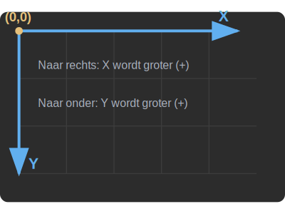

# Begrijpen basic movement script

In deze les leer je wat de verschillende onderdelen van het bewegingsscript doen. Je past elke waarde aan en bekijkt direct het effect in het spel.

De volgende opdrachten helpen je bij het begrijpen van het `basis movement script` dat Godot als standaard voorstelt.
De eerste keren dat je dit script bekijkt kan het lastig zijn. Vandaar hier enkele opdrachten om het script in de vingers te krijgen.


## SPEED aanpassen

### Predict
Kijk eens naar regel 4 in je script: `const SPEED = 300.0`. Wat denk je dat er gebeurt met je karakter als je deze waarde verandert naar `1000.0`?

### Run & Investigate
Pas de waarde van `SPEED` aan naar `1000.0` en start het spel (`F5`). Wat gebeurt er?

<details>
    <summary>Bekijk het antwoord</summary>

Als het goed is, gaat je character veel sneller bewegen!

In plaats van het hele script te kopiëren, hoef je alleen deze regel bovenaan je script aan te passen:
```gdscript
const SPEED = 1000.0
```
</details>


## JUMP_VELOCITY

### Predict
Kijk nu naar regel 5: `const JUMP_VELOCITY = -400.0`. Wat denk je dat er gebeurt als je hier `-800.0` van maakt? Let op dat het een negatief getal is!

### Run & Investigate
Pas de waarde van `JUMP_VELOCITY` aan naar `-800.0` en test het uit. Klopt je voorspelling?

<details>
    <summary>Bekijk het antwoord</summary>

Als het goed is, gaat je character een stuk hoger springen.

Pas hiervoor alleen deze regel aan:
```gdscript
const JUMP_VELOCITY = -800.0
```

**Waarom een negatief getal?**
In wiskunde gaat de y-as vaak naar boven, maar in Godot is dit anders:
- Linksboven in het scherm is `x=0` en `y=0`.
- Naar **rechts** wordt `x` hoger (positief).
- Naar **beneden** wordt `y` hoger (positief).
- Naar **boven** wordt `y` dus *lager* (negatief).

Daarom moet de `JUMP_VELOCITY` negatief zijn om omhoog te springen!


</details>

## is_on_floor()

De functie `is_on_floor()` is erg belangrijk, want deze vertelt ons of de hoofdpersoon de vloer raakt.
Voeg onderstaande `print` regel toe, vlak boven `if not is_on_floor():`, en bekijk wat er gebeurt in de 'Uitvoer' (onderin het scherm).

<details>
    <summary>Bekijk het antwoord</summary>

Als het goed is, zie je in de `Uitvoer` `true` als je hoofdpersoon de vloer raakt, en `false` als hij in de lucht hangt (bijvoorbeeld tijdens een sprong):


Je script-wijziging ziet er zo uit:
```gdscript
	# Add the gravity.
	print(is_on_floor())
	if not is_on_floor():
		velocity += get_gravity() * delta
```
</details>

## Input.is_action_just_pressed

Dan komen we bij de input van de gebruiker:
```
Input.is_action_just_pressed("ui_accept")
```

`ui_accept` is de spatie bij Godot. Als je deze net hebt ingedrukt wordt deze methode waar, anders niet!


## Input.get_axis("ui_left", "ui_right")
Dit stukje code is een beetje ingewikkeld. Wat voor nu belangrijk is:
- als je links inhoudt --> direction = -1
- als je niets doet --> direction = 0
- als je rechts inhoudt --> direction = 1


## velocity
Velocity (snelheid) is iets ingewikkelder. Laten we eens bekijken wat de waarde is van `velocity`.
Voeg `print(velocity)` toe aan je code, nét boven de `move_and_slide()` functie onderaan.

<details>
    <summary>Bekijk het antwoord</summary>

Voeg de `print` toe, zodat het einde van je script er zo uitziet:
```gdscript
	print(velocity)
	move_and_slide()
```
</details>

Als je goed kijkt in de uitvoer, zie je verschillende waardes.
- Welke waardes zie je als je hoofdpersoon stilstaat?
- Welke waardes zie je als je hoofdpersoon naar rechts gaat?
- Welke waardes zie je als je hoofdpersoon naar links gaat?

<details>
    <summary>Bekijk het antwoord</summary>

Stilstaan: (0,0)
Naar links: (-300, 0)
Naar rechts: (300, 0)
</details>

Velocity heeft twee waardes:
- `velocity.x`: hoeveel pixels horizontaal beweegt je hoofdpersoon per seconde?
- `velocity.y`: hoeveel pixels verticaal beweegt je hoofdpersoon per seconde?


## Er gaat iets mis

<details>
<summary>Mijn script geeft een Indentation-fout</summary>

**Oorzaak:** Je hebt tabs en spaties door elkaar gebruikt. GDScript is heel streng: elke regel binnen dezelfde functie moet op dezelfde manier ingesprongen zijn (allemaal tabs óf allemaal spaties).

**Oplossing:**
1. Selecteer de regel die de fout geeft
2. Verwijder de inspringing aan het begin volledig
3. Druk **één keer op Tab** om opnieuw in te springen (Godot gebruikt standaard tabs)

</details>

<details>
<summary>Ik zie niets in de Uitvoer als ik <code>print()</code> gebruik</summary>

**Oorzaak:** Het Output/Uitvoer-paneel staat niet open, of je hebt het spel nog niet gestart.

**Oplossing:**
1. Klik onderaan het scherm op het tabblad **Output** (of **Uitvoer**)
2. Start het spel met `F5`
3. Beweeg je karakter — nu verschijnen de print-regels

</details>

<details>
<summary>Het karakter beweegt niet meer nadat ik iets aanpaste</summary>

**Oorzaak:** Vaak is `move_and_slide()` per ongeluk verwijderd, of staat een regel niet meer correct ingesprongen binnen `_physics_process`.

**Oplossing:**
1. Controleer dat `move_and_slide()` als laatste regel **binnen** `_physics_process` staat (dus ingesprongen)
2. Controleer dat alle regels die bij `_physics_process` horen op dezelfde inspringing staan

</details>
